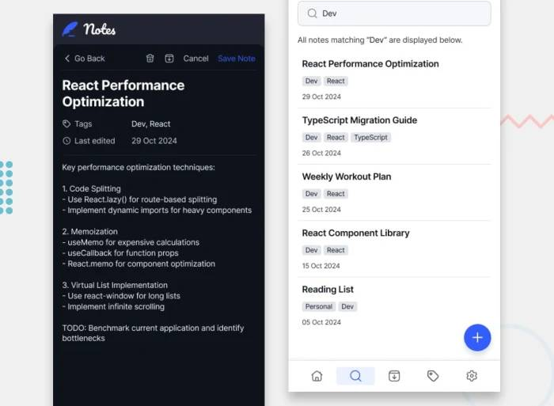

# Notes App

This is both a modernisation of my old TODO App project (also available in the "legacy" branch of this repo) as well as a solution to the [Note-taking web app challenge on Frontend Mentor](https://www.frontendmentor.io/challenges/note-taking-web-app-773r7bUfOG). This re-implementation aims to upgrade the old and somewhat outdated vanilla js application and upgrade it to a more modern version which uses modern web technologies including Reach, TypeScript, and Vite. This transformation enhances functionality, improves user experience, and incorporates contemporary development best practices.

## Table of Contents

- [Overview](#overview)
  - [Features](#features)
  - [Screenshot](#screenshot)
  - [Links](#links)
- [Technologies Used](#technologies-used)
- [Project Structure](#project-structure)
- [Getting Started](#getting-started)
  - [Prerequisites](#prerequisites)
  - [Installation](#installation)
- [Configuration and Linting](#configuration--linting)
- [Acknowledgements](#acknowledgements)

## Overview

### Features

- **Create, Edit, and Delete Notes:** Full CRUD operations for managing your notes. (to be implemented soon)
- **Organize with Categories:** Group your notes into different categories or lists. (to be implemented soon)
- **Priority & Scheduling:** Assign priorities and set due dates with modern libraries. (to be implemented soon)
- **Responsive & Dynamic:** Built to function flawlessly on both desktop and mobile devices.
- **Fast & Efficient Development:** Leveraging React and TypeScript for a robust and efficient build.

### Screenshot




### Links

- The [Live Preview](https://furkanssarri-notes-app.netlify.app/) hosted on Netlify.
- The [Solution](https://www.frontendmentor.io/solutions/path-to-the-solution) on Frontend Mentor. (Soon™)

## Technologies Used

- **React:** For building user interfaces.
- **Vite:** For faster, leaner development experience, optimized with HMR (Hot Module Replacement).
- **TypeScript:** Enabling static typing and better developer experience.
- **ESLint & Prettier:** For maintaining code quality and style.

## Project Structure

```txt
/todo-app
  ├── src/
  │   ├── assets/          # Assets
  │   ├── components/          # React components
  │   ├── styles/              # Custom stylesheets
  │   ├── utils/               # Utility functions
  │   ├── App.tsx             # Main App component
  │   └── index.tsx           # Entry point
  ├── public/                 # Static assets
  ├── tsconfig.json           # TypeScript configuration
  ├── vite.config.ts          # Vite configuration
  └── package.json            # Project metadata and dependencies
```

## Getting Started

### Prerequisites

In addition to Node.js (v14 or higher), the following packages are required:

```json
"dependencies": {
  "@types/react": "19.1.10",
  "@types/react-dom": "19.1.7",
  "date-fns": "4.1.0",
  "motion": "12.23.12",
  "react": "19.1.1",
  "react-dom": "19.1.1",
  "react-icons": "5.5.0",
  "react-markdown": "10.1.0",
  "react-responsive": "10.0.1",
  "react-router-dom": "7.8.1",
  "styled-components": "6.1.19",
  "typescript": "5.8.3",
  "vite": "7.1.2"
}
```

### Installation

1. **Clone the Repository**

   ```bash
   git clone https://github.com/furkanssarri/todo-app.git
   cd todo-app
   ```

2. **Install Dependencies**

   ```bash
   npm install
   ```

3. **Run the App**

   ```bash
   npm run dev
   ```

   This will start the development server at `http://localhost:3000`.

## Configuration & Linting

Expand your ESLint configuration for type-aware lint rules and apply React-specific lint rules for improved development and maintenance:

```js
// eslint.config.js
import reactX from 'eslint-plugin-react-x'
import reactDom from 'eslint-plugin-react-dom'

export default tseslint.config([
  globalIgnores(['dist']),
  {
    files: ['**/*.{ts,tsx}'],
    extends: [
      reactX.configs['recommended-typescript'],
      reactDom.configs.recommended,
    ],
    languageOptions: {
      parserOptions: {
        project: ['./tsconfig.node.json', './tsconfig.app.json'],
        tsconfigRootDir: import.meta.dirname,
      },
    },
  },
])
```

## Author

- Frontend Mentor [@furkanssarri](https://www.frontendmentor.io/profile/furkanssarri)

## Acknowledgements

This project was first developed in [The Odin Project](https://www.theodinproject.com/)'s [Javascript](https://www.theodinproject.com/paths/full-stack-javascript/courses/javascript) curriculum, and then further developed with the inspiration from [Frontend Mentor](https://www.frontendmentor.io/), a platform that challenges developers to create responsive web applications. The Odin Project's curriculum is a great resource for learning web development, and it's a great place to start if you're new to web development.

This project uses the [react-button-component](https://github.com/K-Kelvin/react-button-component) developed by Kelvin Kijanda [k-kelvin](https://github.com/K-Kelvin).

## License

This project is licensed under the MIT License.
